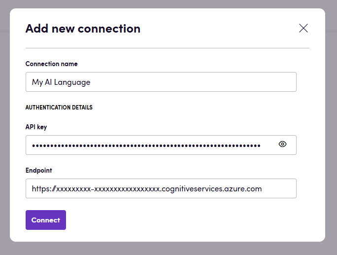

# Blackbird.io Microsoft OpenAI

Blackbird is the new automation backbone for the language technology industry. Blackbird provides enterprise-scale automation and orchestration with a simple no-code/low-code platform. Blackbird enables ambitious organizations to identify, vet and automate as many processes as possible. Not just localization workflows, but any business and IT process. This repository represents an application that is deployable on Blackbird and usable inside the workflow editor.

## Introduction

<!-- begin docs -->

[Azure AI Language](https://azure.microsoft.com/en-us/products/ai-services/ai-language) is a managed service for developing natural language processing applications. Identify key terms and phrases, analyze sentiment, summarize text, and build conversational interfaces. Use Language to annotate, train, evaluate, and deploy customizable AI models with minimal machine-learning expertise.

## Before setting up

Before you can connect you need to make sure that:

- You have set up a Language AI resource on your Azure instance.
- You have the API key and endpoint URL necessary to connect to Language AI. Go to your resource in the Azure portal. The Keys & Endpoint section can be found in the Resource Management section. Copy your endpoint and access key as you'll need both for authenticating your API calls.

## Connecting

1. Navigate to Apps, and identify the **Microsoft AI Language** app. You can use search to find it.
2. Click _Add Connection_.
3. Name your connection for future reference e.g. 'My AI Language'.
4. Enter the `API key`, and `Endpoint` for your Language AI instance.
5. Click _Connect_.
6. Verify that connection was added successfully.

## Actions

All Language AI actions take a text as input.

- **Analyze sentiment** provides sentiment labels (such as "negative", "neutral" and "positive") based on the highest confidence score found by the service at a sentence and document-level. This feature also returns confidence scores between 0 and 1 for each document & sentences within it for positive, neutral and negative sentiment.
- **Detect language** returns one predominant language for each document you submit, along with its ISO 639-1 name, a human-readable name and confidence score.
- **Extract key phrases** returns the key phrases of a text. For example, in the text _"The food was delicious and the staff were wonderful."_, key phrase extraction will return the main topics: _"food"_ and _"wonderful staff"_.
- **Find linked entities**  identifies and disambiguates the identity of entities found in text. For example, in the sentence _"We went to Seattle last week."_, the word _"Seattle"_ would be identified, with a link to more information on Wikipedia.
- **Identify personally identifiable information** can identify, categorize, and redact sensitive information in unstructured text. For example: phone numbers, email addresses, and forms of identification.
- **Summarize text (abstractive)** generates a summary with concise, coherent sentences or words that aren't verbatim extract sentences from the original document.
- **Summarize text (extractive)** produces a summary by extracting salient sentences within the document, together the positioning information of these sentences.

## Feedback

Do you want to use this app or do you have feedback on our implementation? Reach out to us using the [established channels](https://www.blackbird.io/) or create an issue.

<!-- end docs -->